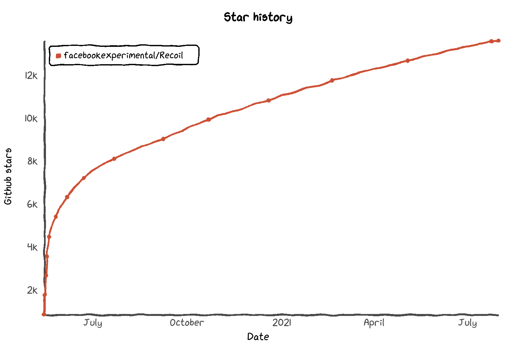
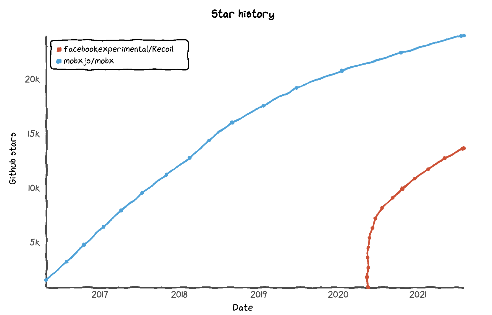

# Build your own Recoil


[Recoil](https://recoiljs.org/) is a new experimental state management library for React provided by Facebook. The core concept of it is Atoms and Selectors:

#### Atom

Atom is a unit of state. An example of it can be some text state that represents user's input:

```js
const textState = atom({
  key: 'textState',
  default: '',
});
```

With the help of `useRecoilValue` or `useRecoilState` hooks it is possible to use atoms in a React component:

```js
function TextInput() {
  const [text, setText] = useRecoilState(textState);
  const onChange = (event) => {
    setText(event.target.value);
  };

  return <input type="text" value={text} onChange={onChange} />;
}
```

#### Selector

Selector is a pure function that accepts atoms and represents a piece of derived state:

```js
const charCountState = selector({
  key: 'charCountState',
  get: ({get}) => {
    const text = get(textState);

    return text.length;
  },
});
```

Same as for atom `useRecoilValue` or `useRecoilState` hooks have to be used:

```js
function CharacterCount() {
  const count = useRecoilValue(charCountState);

  return <>Character Count: {count}</>;
}
```

Recoil is getting more and more popular and today it has more than [13k stars](https://star-history.t9t.io/#facebookexperimental/Recoil).


That makes it promising for use in projects. The only downside is that the recoil project is still experimental. And it can give some risks in future.

From the other side, you might be used to another state management. It can be [Redux](https://redux.js.org/), [RxJS](https://rxjs.dev/), [MobX](https://mobx.js.org/README.html), events from [Leaflet](https://github.com/Leaflet/Leaflet/blob/master/src/core/Events.js) and so on. So can you stay with it and make the project ready for migration to recoil? Or can you have a plan B for a case if Recoil will not be released? The answer to both questions is yes and  let's check how to do it on top of MobX.

## MobX

[MobX](https://mobx.js.org/getting-started) is a simple, scalable and tested state management solution with it's own concept:

> Make sure that everything that can be derived from the application state, will be derived. Automatically.

The library has more than [24k stars](https://star-history.t9t.io/#facebookexperimental/Recoil) and has only [5 opened issues](https://github.com/mobxjs/mobx/issues) that indicates it's really good stability.



To implement `textState` with MobX the only thing you need is to use class and make it reactive:

```js
class TextState = {
  text = "";

  constructor() {
    constructor() {
      makeAutoObservable(this);
  	}
  }

  setText(nextText) {
    this.text = nextText;
  }
}
```

After that it is possible to use it in any React component:

```js
const textState = new TextStat();
function TextInput() {
  const {text, setText} = textState;
  const onChange = (event) => {
    setText(event.target.value);
  };

  return <input type="text" value={text} onChange={onChange} />;
}
```

The downside of that solution might be the fact that you need to introduce a new dependency [mobx-react](https://github.com/mobxjs/mobx/tree/main/packages/mobx-react) and use `observer`, so that component will react to changes.

To solve the issues mentioned above it is possible to build your own "Recoil wrapper" on top of MobX and implement the exact functionality you need.


## MobX-Recoil

Let's start with the `atom` implementation. Looking at it's Recoil implementation there are two things we need to know about it:

### Options

Options parameter, that accepts `key` and `default` value (*we are not going to cover all Recoil functionality*):

```js
interface Config<T> {
  key: string;
  default: T;
}
```

### Atom

To implement Atom it we need:

```js
interface AtomType<T> {
  key: string;
  value: T;
  update: (nextValue: T) => void;
}
```

Knowing that it is possible to create a function that will accept `Config` and build `AtomType`:

```
export function atom<T>(config: Config<T>): AtomType<T> {
  class AtomImpl implements AtomType<T> {
    key: string = config.key;

    value: T = config.default;

    constructor() {
      makeAutoObservable(this);
    }

    update(nextValue: T) {
      this.value = nextValue;
    }
  }

  return new AtomImpl();
}
```

This allows the creation of a mobx observable class that can be used as a standalone class or passed to `useRecoilValue` or `useRecoilState` hooks.

### useRecoilState

That will be a React hook that accepts an atom and returns its value. The value will be also stored with the help of `useState` hook that also gives a possibility to react on changes:

```js
export function useRecoilState<T>(atom: AtomType<T>): [T, (value: T) => void] {
  const [value, setValue] = useState<T>(atom.value);
  useEffect(() => {
    const disposer = autorun(() => {
      setValue(atom.value);
    });
    return disposer;
  }, [atom]);
  return [
    value,
    (value: T) => {
      atom.update(value);
    }
  ];
}
```

### useRecoilValue

That Recoil hook is easily to implement using `useRecoilState` and getting the first value of the result array:

```js
export function useRecoilValue<T>(atom: AtomType<T>): T {
  return useRecoilState(atom)[0];
}
```

### Selector

The next thing needed to be implemented is a `selector`. Each selector should implement a possibility to `get` and `set` atoms. We will focus on `get` functionality. And same as for `atoms`, each selector should have a `key` property. Knowing this, we need to implement functionality for:

```js
export function selector<T>(options: {
  key: string;
  get: (util: { get: <V>(atom: AtomType<V>) => V }) => T;
}): AtomType<T> {
  ...
}
```

To get the actual value of the atom `options.get` can be used. That gives us a possibility to define new local `atom` that will represent the value and react to changes, using `autorun` from MobX. In that case the final implementation for `selector` can be:

```js
export function selector<T>(options: {
  key: string;
  get: (util: { get: <V>(atom: AtomType<V>) => V }) => T;
}): AtomType<T> {
  const get = (atom: AtomType<any>) => {
    return atom.value;
  };

  const getActualValue = () => options.get({ get });

  const resultAtom = atom({
    key: options.key,
    default: getActualValue()
  });

  autorun(() => {
    resultAtom.update(getActualValue());
  });

  return resultAtom;
}
```

That is basically everything that we need and at this moment we can already start using "Recoil" in the project.

### Benefits of that implementation

One of the benefits is that you can use the state management library you like in a new way. Another thing is the possibility to define custom atoms. For instance let's say you need to trigger some actions (could be an API call to trigger search) when `textState` atom is changed. To do it with Recoil you need to use `effects_UNSTABLE`. And using MobX you can provide a custom atom implementation:

```js
const textState = atom(textStateMobx);
```

where `textStateMobx` is some implementation of `AtomType` with additional functionality:

```js
class TextState implements implements AtomType<string> {
  key: string = 'textState';

  value: string = '';

  constructor() {
    makeAutoObservable(this);
    this.debouncedApiCall = debounce(this.doApiCall, DEBOUNCE_TIME);
  }

  update(nextValue: string) {
    this.value = nextValue;
    debouncedApiCall();
  }

  doApiCall() {
    if (this.value.length > MIN_LENGTH) {
      // some api call
    }
  }
}
```

# Building "mobx-recoil" application

Recoil provides an [example](https://recoiljs.org/docs/introduction/getting-started) with a text input and entered symbols counter. There is almost no need to adjust it and the entire example can be taken:

```js
function TextInput() {
  const [text, setText] = useRecoilState(textState);

  const onChange = (event) => {
    setText(event.target.value);
  };

  return (
    <div>
      <input type="text" value={text} onChange={onChange} />
      <br />
      Echo: {text}
    </div>
  );
}

function CharacterCount() {
  const count = useRecoilValue(charCountState);

  return <>Character Count: {count}</>;
}

function CharacterCounter() {
  return (
    <div>
      <TextInput />
      <CharacterCount />
    </div>
  );
}

export default function App() {
  return <CharacterCounter />;
}
```

The only difference will be that `atom`, `selector`, `useRecoilState` and `useRecoilValue` has to be imported from your locally defined "Recoil" implementation instead of `'recoil'`:

```js
import React from 'react';
import {
  atom,
  selector,
  useRecoilState,
  useRecoilValue,
} from './mobx2recoil';
```

A working example is available in [codesandbox](https://codesandbox.io/s/throbbing-glitter-4zrcg?file=/src/App.tsx).


Thanks for reading and I hope you enjoyed the idea. A working example is available in codesandbox. And good luck with the coding!


